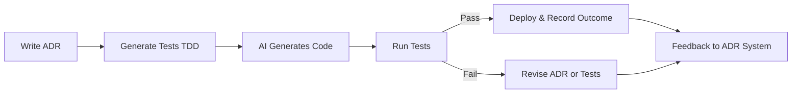

# Add CLAUDE.md for Better Agent Coding Support

status: accepted
date: 2025-10-25
decision-makers: Owen Zanzal

## Context and Problem Statement

AI coding agents like Claude Code, GitHub Copilot, and Cursor are becoming increasingly common tools for software development. These agents benefit from having structured documentation that helps them understand project-specific conventions, architecture, and development workflows. How can we make MADR easier for AI agents to work with effectively?

## Decision Drivers

* AI agents need to understand project structure quickly without extensive codebase exploration
* Key architectural patterns (like template synchronization between `template/` and `docs/`) require reading multiple files to understand
* Branch strategy (`develop` as main branch, not `main`) is non-standard and needs explicit documentation
* Development commands and workflows are scattered across README.md and CONTRIBUTING.md
* The `/init` command in Claude Code creates project-specific guidance files for future agent sessions

## Considered Options

* Add CLAUDE.md following Claude Code conventions
* Add .cursorrules for Cursor AI
* Add .github/copilot-instructions.md for GitHub Copilot
* Do nothing - rely on agents reading existing documentation

## Decision Outcome

Chosen option: "Add CLAUDE.md following Claude Code conventions", because it provides a standardized location for agent-specific guidance, follows emerging conventions in the AI coding space, and can serve as a model for other agent-specific documentation files if needed later.

### Consequences

* Good, because AI agents can quickly understand project architecture and conventions
* Good, because it consolidates development workflow information in one place
* Good, because it reduces the need for agents to explore multiple files to understand key patterns
* Good, because it documents the template synchronization requirement that is critical but not obvious
* Neutral, because it creates another documentation file to maintain
* Neutral, because it's specific to one tool (Claude Code) but could be extended to others

## Pros and Cons of the Options

### Add CLAUDE.md following Claude Code conventions

* Good, because Claude Code's `/init` command specifically creates this file
* Good, because CLAUDE.md is becoming a recognized convention in AI-assisted development
* Good, because it can include project-specific architecture that requires understanding multiple files
* Good, because it focuses on "big picture" information rather than file-by-file details
* Bad, because it requires maintenance when project structure changes
* Bad, because it's specific to one AI coding tool

### Add .cursorrules for Cursor AI

* Good, because Cursor is a popular AI coding editor
* Good, because .cursorrules is Cursor's standard configuration file
* Bad, because it's specific to Cursor and doesn't help other AI agents
* Bad, because Cursor rules format is different from documentation-style guidance

### Add .github/copilot-instructions.md for GitHub Copilot

* Good, because GitHub Copilot has large market share
* Good, because it follows GitHub's standard location
* Bad, because it's specific to GitHub Copilot
* Bad, because the format and capabilities differ from other agent guidance systems

### Do nothing - rely on agents reading existing documentation

* Good, because it requires no additional maintenance
* Good, because existing documentation (README.md, CONTRIBUTING.md) already contains most information
* Bad, because information is scattered across multiple files
* Bad, because agents must perform extensive exploration to understand architecture
* Bad, because critical patterns (template sync, branch strategy) are not immediately obvious

## More Information

The CLAUDE.md file includes:

* Development commands (Jekyll serve, markdownlint, npm)
* Repository structure and the relationship between `template/` and `docs/`
* Branch strategy and git flow conventions
* Template synchronization requirements
* ADR naming conventions
* Key design decisions with references to relevant ADRs
* Release process overview

This follows the Claude Code documentation guidance that CLAUDE.md should focus on "big picture" architecture that requires reading multiple files to understand, rather than obvious file structures or generic development practices.

### ADR-Driven AI Development Framework

This ADR also documents an extended framework for combining ADRs, AI, and Test-Driven Development (TDD) to create a self-learning development loop. This framework positions ADRs as the central artifact that guides both human and AI collaboration.

#### Core Principles

**ADRs as Anchors** — Each decision is documented with context, options, rationale, and outcomes. ADRs serve as the single source of truth for architectural intent.

**AI as Executor** — AI agents use ADRs (and optional specifications) to generate implementation code that aligns with documented decisions.

**TDD as Guardrail** — Tests are written first to validate that AI output satisfies the ADR's intent and requirements.

**Feedback Loop** — Implementation results feed back into new or updated ADRs, improving future outcomes and creating organizational learning.

#### Extended ADR Template for AI Agents

When using ADRs to guide AI development, consider extending the standard MADR template with these additional sections:

| Section | Description |
|---------|-------------|
| **AI Guidance Level** | Defines how much freedom the AI has: strict (follow exact specifications), flexible (interpret intent with some creativity), or exploratory (research and propose alternatives) |
| **AI Tool Preferences** | Which AI tools/models to use and their parameters (e.g., "Use Claude Code for implementation, GitHub Copilot for completion") |
| **Test Expectations** | Specific tests that validate alignment with the ADR's intent (TDD approach) |
| **Dependencies** | Related ADRs or system components that must be considered |
| **Timeline** | When this ADR should be revisited or reviewed |
| **Risk Assessment** | Technical and business risks associated with this decision |
| **Human Review** | Whether human approval is required before implementation |
| **Feedback Log** | Notes from AI agents or team members about implementation results |
| **Learning Reinforcement** | Key insights that should be carried forward to future decisions |

These extensions transform ADRs from static documentation into dynamic guidance systems that improve over time.

#### Development Workflow

The AI-driven development workflow creates a continuous improvement cycle:

1. **Write ADR** — Document the architectural decision with context, alternatives, and expected consequences
2. **Generate Tests (TDD)** — Create tests that validate the ADR's requirements before implementation
3. **AI Generates Code** — AI agent uses the ADR and tests to generate implementation
4. **Run Tests** — Validate that implementation aligns with ADR intent
5. **Deploy & Record Outcome** — On success, deploy and document actual results in the ADR
6. **Revise ADR or Tests** — On failure, update either the ADR (if requirements were unclear) or tests (if they don't properly validate intent)
7. **Feedback to ADR System** — All outcomes feed back to improve future ADRs and AI guidance

#### Feedback and Evolution

To maximize learning from this framework:

* **Version ADRs** — Tie decisions to specific releases or branches for traceability
* **Measure Drift** — Compare AI output against ADR intent over time to identify where guidance needs improvement
* **Automate Insights** — Enable AI to analyze ADR patterns and suggest improvements
* **Continuous Improvement** — Each ADR update refines both human reasoning and AI understanding

This creates a system where development becomes more transparent, traceable, and adaptive over time. The ADR becomes a living artifact that unifies human architectural reasoning with AI execution capabilities.

#### Benefits

* **Transparency** — All architectural decisions and their rationale are explicitly documented
* **Traceability** — Implementation can be traced back to specific decisions and requirements
* **Adaptability** — The feedback loop enables continuous improvement of both decisions and implementations
* **Knowledge Transfer** — ADRs become a shared language between humans and AI agents
* **Quality Assurance** — TDD ensures AI output meets documented requirements

#### Future Extensions

* **AI-assisted ADR drafting** — AI agents help generate decision options and analyze trade-offs
* **ADR compliance dashboards** — Visualize which parts of the codebase align with current ADRs and identify drift
* **Cross-project learning** — AI models improve from analyzing ADR histories across multiple projects
* **Automated ADR updates** — AI suggests ADR revisions based on implementation experiences
* **Decision impact analysis** — Track how architectural decisions affect system metrics over time

### General Future Considerations

If other AI coding tools become widely adopted in MADR development, we could add their respective configuration files (.cursorrules, .github/copilot-instructions.md) using this ADR as a template for what information should be included.
